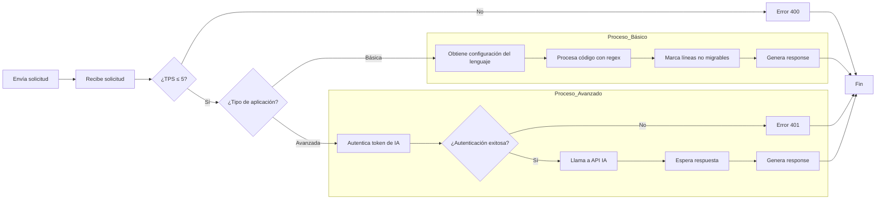
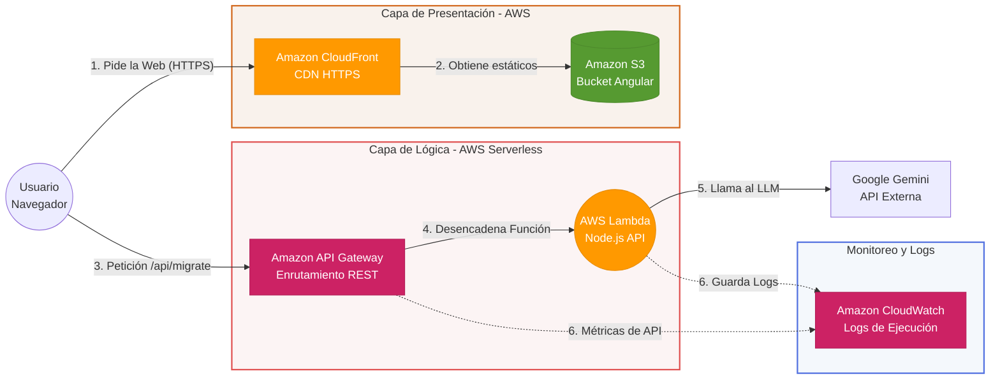

# Reto Legacy2Modern - Motor de Migracion

Este proyecto es una solucion para migrar codigo legacyc ya sea COBOL o Delphi a tecnologias modernas especificas como Node.js, Java, Python y Go. Fue desarrollado implementando dos motores de migracion uno basado en reglas y otro usando Inteligencia Artificial Generativa (GEMINI), una api rest en Node.js y una interfaz en Angular.

---

# Parte 1 & 2 - Motor de Migracion e Interfaz Web

La aplicacion tiene dos enfoques distintos los cuales se pueden seleccionar desde el front:

1. Basico o Regex (Ruta `\migrate-code`): Traduce sentencias de COBOL o Delphi especificas como if, move, entre otras a lenguages como node.js, java, python y Go, adicionalmente genera un reporte con el numero de reglas que se aplicaron y las advertencias sobre las reglas que no se han cofigurado para migrar
2. Avanzado o IA (Ruta `\migrate-code-ai`): Integra gemini para analizar el contexto del codigo y reescribirlo en los lenguajes mencionados anteriormente.

---

# Parte 3 - Arquitectura

La aplicacion tiene arquitectura cliente-servidor, separando las responsabilidades y permitiendo escalabilidad:

1. **Frontend (Presentacion - Angular):** Es un SPA, ya que para el reto no se necesitan mas pantallas, se encarga de gestionar el estado, interactuar con el usuario y realizar las peticiones http al backend.
2. **Backend (Controlador - Node.js/Express):** Recibe las peticiones y enruta hacia el motor definido (`\migrate-code` o `\migrate-code-ai`).
3. **Externo (API Gemini):** el backend se conecta por medio de @google/generative-ai a la api de Gemini para realizar la migracion del codigo.

**Flujo A:**
\`Frontend\` ➔ \`HTTP POST Request \migrate-code\` ➔ \`API Node.js\` ➔ \`Output JSON\` ➔ \`Frontend\`

**Flujo B:**
\`Frontend\` ➔ \`HTTP POST Request \migrate-code-ai\` ➔ \`API Node.js\` ➔ \`External AI API\` ➔ \`Output JSON\` ➔ \`Frontend\`

# Parte 3.1 - Patrones de diseño
El backend fue construido con una arquitectura en capas (Layered Architecture) en TypeScript y se implementaron varios patrones de desarrollo

1.  **Patron Estrategia:** se implementa `BaseTranslator` que contiene las reglas comunes entre lenguajes.
2.  **Mapa de Acciones:** en un inicio como se habia planteado un solo lenguaje de migracion se tenia un `switch` pero al agregar mas funcionalidades y lenguajes este fue aumentando de tamaño lo que hace que a futuro no sea manejable, por esto se usa un diccionario de funciones `O(1)`.
3.  **Separacion de Responsabilidades:** Division de Rutas, Controladores, Servicios.

---

# Parte 4 - Arquitectura de Despliegue (Opcion B - AWS)

Para esto se realizaron varias consultas sobre la capa gratuita de AWS y se vio que este proyecto puede ser desplegado en esta:

* **Frontend (Amazon S3 + CloudFront):** Los archivos compilados de Angular se alojan en un bucket S3, expuesto por CloudFront sobre https.

* **Backend (AWS Lambda + Amazon API Gateway)**: La API de Node.js se ejecuta en Lambda, se usa API Gateway para enrutar hacia la Lambda. Las variables de entorno se guardan de forma segura en configuracion de Lambda.
* **Observabilidad:** Logs en Amazon CloudWatch.

---

# Parte 5 - Seguridad

## 1. Fuga de credenciales
* **Riesgo:** Exposicion secretos como la `GEMINI_API_KEY` en repositorios publicos.
* **Mitigacion:** * Uso de `.gitignore` para excluir el archivo .env
  * En el despliegue en AWS, uso de Secrets Manager.

### 2. Abuso de la API
* **Riesgo:** Gran volumen de peticiones que agoten los recursos o disparen los costos por uso de la API externa de Gemini.
* **Mitigacion:**
  * Implementar express-rate-limit para limitar el numero de peticiones que se pueden realizar por minuto.
  * Establecer limites y alertas de presupuesto para los servicios de terceros.

## 3. Validacion de entrada
* **Riesgo:** Se podrian ingresar cadenas de caracteres extremadamente largas y complejas o lenguajes que no soporta actualmente el motor.
* **Mitigacion:** * Implementar libreria zod para realizar la validacion estricta del tamaño de los datos de entrada.
  * Implementar Emuns dentro de un middleware para que solo se reciba exactamente lo que se requiere node.js, java, python y Go.
  * Generar un prom delimitado para que la IA solo devuelva codigo fuente y rechace cualquier otra instruccion.

------------------------------------------------------------------------------------

# Instalacion Local

## 1. Requisitos Previos
* Angular CLI: 18.2.11
* Node: 20.11.1
* Package Manager: npm 10.2.4
* Una API Key de Google AI Studio (Gemini).

## 2. Configuracion del Backend
* Descargar el repositorio del back localmente
  * https://github.com/angelikv0926/legacy2Modern-back
* npm i

Crear un archivo .env en la raiz del proyecto backend con la clave de Gemini:
+ GEMINI_API_KEY=AIXXXclave_secretaXXXX
+ GEMINI_MODEL=gemini-2.5-flash
+ PORT=3000

Inicia el servidor en modo desarrollo:
* npm run dev

## 3. Configuracion del Frontend

* Descargar el repositorio del front localmente
  * https://github.com/angelikv0926/legacy2Modern-front
* npm i
* ng serve

+ Ingresar a la ruta:
+ http://localhost:4200